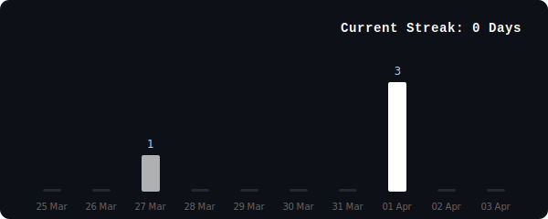

<h2>  Hey, I'm Javad! </h2>


**Full Stack Engineer** | Building scalable systems 

[](https://linkedin.com/in/javaadde)
[](https://instagram.com/javaadde)
[](https://javade.xyz)
[](mailto:jawaadde@gmail.com)

<!-- [](https://github.com/javaadde) -->
---

###  Quick Bio

```javascript
const javad = {
  pronouns: "he" | "him",
  code: ["JavaScript", "TypeScript", "C", "Java", "HTML", "CSS"],
  frontend: ["React", "Next.js", "TailwindCSS" ,"ShadCn"],
  backend: ["Node.js", "PostgreSQL", "Redis"],
  devops: ["Github Actions", "AWS"],
  tools:["n8n",""]
  languages: ["Malayalam", "English"],
  techCommunities: {
    member: "WeCode Tech Community",
  },
  education: "Student @ Devxtra Academy",
  passion: "Building high-performance systems ",
  challenge: "100 Days Github Streak Challenge"
}
```

---

###  Stack & Tools


---


<!-- START_STATS -->
### 📊 GitHub Real-time Stats

<p align="center">
  
</p>


<div align="center">
  <sub>Last automated update: February 05, 2026 • Built with ⚡ by Javad</sub>
</div>
<!-- END_STATS -->

---


### 🏆 What I Do

<div align="center">
  <table>
    <tr>
      <td align="center" width="200" style="padding:5px;">
        <h3>🚀 Building</h3>
        Microservices<br/>
        Real-time APIs<br/>
        Scalable Systems<br/>
      </td>
      <td align="center" width="200">
        <h3>🌱 Learning</h3>
        Redis<br/>
        Docker<br/>
        Kubernetes
      </td>
      <td align="center" width="200">
        <h3>💬 Ask Me About</h3>
        React / Next.js<br/>
        System Design<br/>
        Cloud Arch
        <br/>
      </td>
    </tr>
  </table>
</div>

---

### 🤝 Let's Connect!
 <em><b>I love connecting with different people</b> so if you want to say <b>hi, I'll be happy to meet you more!</b> :)</em>

<div align="center">


**Made with ⚡ by javaadde**

*"Ship fast. Optimize hard. Never stop learning."* 🚀


</div>
