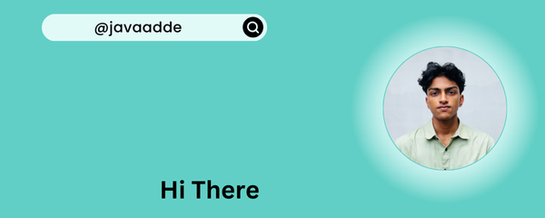

	
<a target="_blank" href="https://www.linkedin.com/in/javad-muhammed-995a85329/">
</img></a>
&emsp;
<a target="_blank" href="mailto:iamkuttappiii@gmail.com">
</img></a>
&emsp;
<a target="_blank" href="https://instagram.com/javaadde">     
</img></a>
&emsp;
<a target="_blank" href="https://">
</img></a>
&emsp;
<a target="_blank" href="https://javaadde.github.io/portfolio/">
</img>
</a>

<h2 align="center">⚡ Stats ⚡</h2>
 

  <!--  -->

  
   
    

<h1 align="center" style="margin-top:70px;"> skills </h1>
 

<h2 align="center"> Languages 🌐 And ⚒ Tools </h2>

    
   

<h2 align="center" style="margin-top:90;"> Trophies 🏆</h2>

